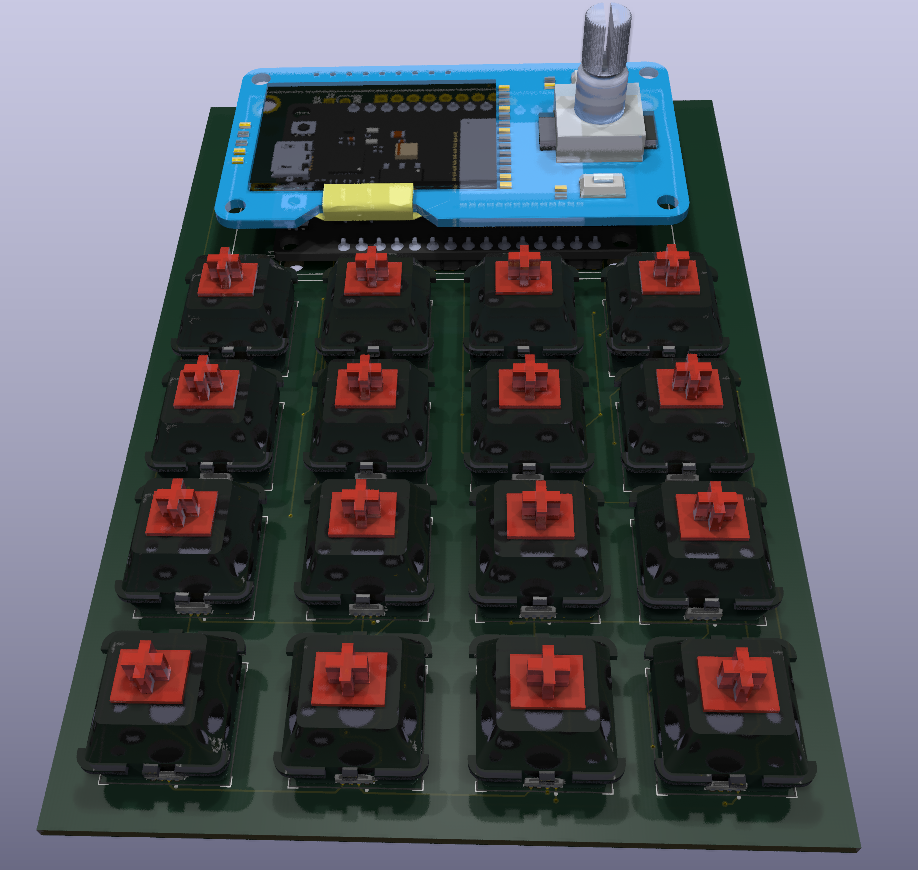
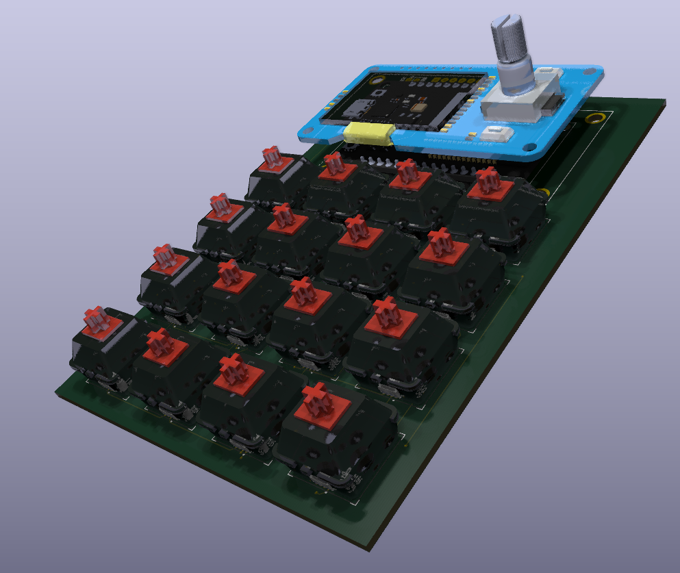
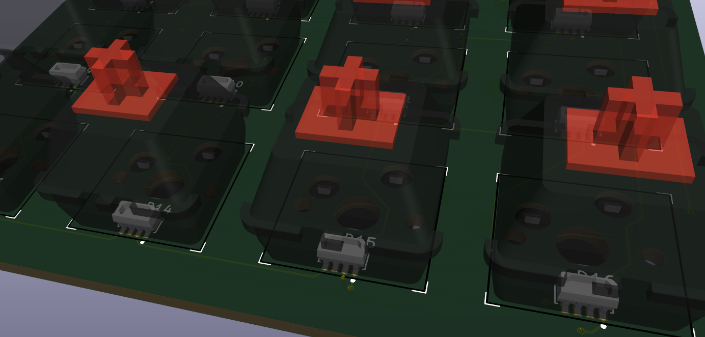
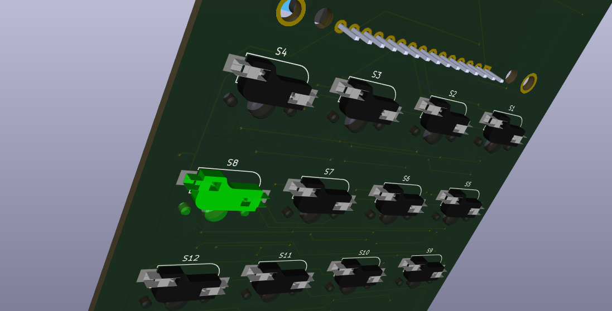

# BLEDeck

[](https://github.com/argaar/BLEDeck/actions/workflows/tests.yml)

A custom BLE macro pad controlled by a Windows desktop application. Press a key, run a command. Switch profile, change context. Everything is driven by the app, the device is a pure peripheral.

<p align="center">
  
  
</p>

---

## Overview

BLEDeck is a 4×4 mechanical keypad with per-key RGB lighting, a rotary encoder, and an OLED display, built around an ESP32. It communicates over BLE with a Windows app that maps each key to a shell command or executable. Profiles let you maintain separate key layouts for different workflows.

The device carries no persistent state. Every time the app connects, it pushes the current profile names and key colors to the device. This is by design, the app is the source of truth.

---

## Hardware

| Component | Part |
|-----------|------|
| MCU | ESP32 DevKitC v1 (NodeMCU-32S) |
| Keys | 16 × Gateron switches (CherryMX style) on Kailh hot-swap sockets |
| RGB | 16 × WS2812B-4020 side-emitting SMD LEDs |
| Display | SSD1306 128×64 OLED |
| Encoder | EC11 rotary encoder with push button |
| Extra buttons | CON (confirm) + BACK, mounted beside the encoder |
| Battery | Optional 1S LiPo with 15 kΩ / 4.3 kΩ voltage divider on GPIO 13 |
| PCB | Custom KiCad design, v1.1 (files under `pcb/`) |

<p align="center">
  
  
</p>

---

## Repository Layout

```
BLEDeck/
├── firmware/          PlatformIO project (ESP32 Arduino)
│   └── src/
│       ├── main.cpp            Main loop, BLE callbacks, all handlers
│       ├── configuration.h     Pin map, BLE limits, battery constants
│       ├── protocolparser.h    Binary protocol definition + packet parser
│       ├── ota_manager.h/.cpp  WiFi OTA update manager (ElegantOTA)
│       ├── menu.h              Simple OLED settings menu
│       ├── images.h            XBM splash/lock screen bitmaps
│       └── credentials.h       WiFi + OTA password (gitignored, see below)
├── windows_app/       PyQt5 desktop application
│   ├── main.py                 BLEDeck GUI, BLE lifecycle, notification dispatch
│   ├── key_button.py           KeyButton widget
│   ├── ble_protocol.py         Packet builders, parsers, opcode constants
│   ├── ble_client.py           BleakClient re-export, BLE UUIDs, simulator factory
│   ├── profile_manager.py      Load/save profiles.json
│   ├── app_settings.py         Persistent app-level settings (preferred device MAC, …)
│   ├── action_runner.py        Command/macro dispatch with re-entrancy guard
│   ├── macro_models.py         Immutable step types + JSON serialization
│   ├── macro_recorder.py       pynput-based recorder with window anchor detection
│   ├── macro_player.py         Synchronous macro playback
│   ├── macro_dialog.py         MacroDialog QDialog (record, edit, reorder, test)
│   ├── win32_utils.py          Windows API helpers (window/monitor detection)
│   └── tests/                  Pytest suite
│       ├── test_ble_protocol.py
│       ├── test_profile_manager.py
│       ├── test_action_runner.py
│       └── test_macro_models.py
├── simulator/         BLE device simulator (no hardware needed)
│   ├── __main__.py             Entry point: python -m simulator [--ble]
│   ├── _context.py             Module-level singletons (DeviceState, active client)
│   ├── device_state.py         Simulated device state
│   ├── command_handler.py      PC→Device command handler
│   ├── event_emitter.py        Device→PC event builders
│   ├── ble_server.py           Real BLE via WinRT GattServiceProvider (Mode B)
│   ├── fake_bleak_client.py    In-process loopback (Mode A)
│   ├── cli.py                  Interactive REPL
│   └── tests/                  Pytest suite
├── pcb/               KiCad schematic + layout + Gerbers
├── docs/              Protocol reference and debugging guides
│   ├── ble_protocol_reference.md
│   ├── protocol_debugging.md
│   └── hex_quick_reference.md
└── debug/
    └── protocol_decoder.py     CLI tool to decode raw BLE packets
```

---

## Firmware

Full setup and configuration details: [`firmware/README.md`](firmware/README.md)

### Features

- **BLE GATT server** - custom service with a TX (notify) and RX (write) characteristic
- **Binary protocol** - compact framed packets: `0xAA | OPCODE | LENGTH(2B) | PAYLOAD`; max payload 256 bytes
- **Profile management** - up to 10 profiles; names and current index are pushed by the app on connect
- **Rotary encoder** - cycles through profiles when the app is connected; plays an idle RGB animation when disconnected
- **Per-key RGB** - 16 WS2812B LEDs, colors set individually or all at once by the app
- **OLED display** - shows current profile name, BLE connection status, and battery percentage
- **Battery monitoring** - ADC reading every 30 s, 5-sample rolling average, reported to the app via opcode `0x85`
- **Workstation lock** - when locked by the app, the OLED dims and shows a lock icon; all key events are suppressed
- **OTA updates** - long-press the encoder push button to open the settings menu, select *OTA Update*; the device connects to WiFi (or falls back to an AP) and serves the ElegantOTA web UI
- **`OP_HELLO` / `OP_DEVICE_TELEMETRY` handshake** - on connect the app sends `OP_HELLO` with its protocol/app version, the device replies with telemetry (firmware version, uptime, free heap, BLE error count)
- **OTA HTTP auth rate-limit infrastructure** - 5 failed logins within 60 s trigger a 5-minute lockout (trigger awaits an ElegantOTA upstream hook)

### Firmware Setup

1. Install [PlatformIO](https://platformio.org/).
2. Copy `firmware/src/credentials.h.example` → `firmware/src/credentials.h` and fill in:
   ```cpp
   #define OTA_WIFI_SSID     "your_ssid"
   #define OTA_WIFI_PASSWORD "your_wifi_password"
   #define OTA_HTTP_PASSWORD "your_ota_http_password"
   ```
3. Build and flash:
   ```bash
   cd firmware
   pio run --target upload
   ```

---

## Windows App

Full setup and usage details: [`windows_app/README.md`](windows_app/README.md)

### Features

- Scan and connect to BLEDeck over BLE (auto-reconnect optional)
- **Per-key configuration** - label, RGBW color (with color picker + brightness slider), action
- **Two action types per key** - shell command (via `subprocess`) or recorded macro
- **Macro recorder** - capture mouse clicks and keystrokes; replay them on key press
  - Per-click window/monitor-relative coordinates: clicks are anchored to the window or monitor they were recorded on, so playback works even if windows have moved
  - Multi-monitor support: monitors indexed by left edge (0 = leftmost)
  - Edit individual steps, drag-to-reorder, delete steps, test-run from the dialog
- **Profile management** - create, rename, save, and delete profiles; stored in `profiles.json`
- **Live RGB sync** - changing a key color sends the update to the device immediately
- **Battery indicator** - displays the battery percentage reported by the device
- **System tray** - minimises to tray, double-click or single-click to restore
- On connect: pushes all profile names, then the current profile index + RGB colors
- **Rotating debug log** at `%APPDATA%\BLEDeck\logs\bledeck.log` (5 × 20 MB rotation, 100 MB cap; KEEP_ALIVE traffic filtered out)
- **Preferred device MAC pinning** + **exponential reconnect backoff** (10 s → doubles per failed attempt → 5 min cap; resets on success)
- **High-risk command-token warning** on profile load — flags commands containing tokens such as `powershell`, `cmd /c`, `iex`, `curl … | iex`, `bitsadmin`, `mshta` before they can run
- **Macro recorder auto-stop** after 60 s of idle keyboard / mouse activity

### App Setup

```bash
cd windows_app
pip install -r requirements.txt
python main.py
```

> Python 3.12 or later required. Tested on Windows 11.

### Development Without Hardware

A device simulator is included — no physical BLEDeck required.

Loopback mode (default): no Bluetooth, instant connect. Pick the row for your shell:

| Shell       | Command |
|-------------|---------|
| cmd.exe     | `set BLEDECK_SIM=1 && python windows_app\main.py` |
| PowerShell  | `$env:BLEDECK_SIM=1; python windows_app\main.py` |
| Git Bash    | `BLEDECK_SIM=1 python windows_app/main.py` |

Real BLE mode (two machines): simulator on Machine A, app on Machine B:

```bash
python -m simulator --ble
```

Full details: [`simulator/README.md`](simulator/README.md)

---

## BLE Protocol

Full reference: [`docs/ble_protocol_reference.md`](docs/ble_protocol_reference.md)

| Direction | Opcodes |
|-----------|---------|
| PC → Device | `0x01` KEEP_ALIVE, `0x02` CHANGE_PROFILE, `0x03` SYNC_PROFILES, `0x04` SET_RGB_KEY, `0x05` SET_ALL_RGB_KEYS, `0x06` LOCK_DEVICE, `0x07` HELLO |
| Device → PC | `0x81` KEEP_ALIVE_REPLY, `0x82` PROFILE_CHANGED, `0x83` BUTTON_PRESSED, `0x84` KEY_PRESSED, `0x85` BATTERY_STATUS, `0x86` DEVICE_TELEMETRY |

To decode a raw packet from the log:
```bash
cd debug
python protocol_decoder.py "aa 85 00 01 48"
# or interactive:
python protocol_decoder.py
```

For advanced debugging see [`docs/protocol_debugging.md`](docs/protocol_debugging.md)
If you're interested in understanding the protocol, take a look at [`docs/hex_quick_reference.md`](docs/hex_quick_reference.md)

---

## Intended Use

BLEDeck is designed for Windows power users who want a physical shortcut pad without writing firmware macros. Key assignments live entirely in the app, change them without reflashing.

Typical profiles:
- **Dev** - open IDE, terminal, browser, run build script
- **Media** - control Spotify, OBS, volume
- **Gaming** - push-to-talk, clips, Discord mute
- **Comms** - join meeting, mute mic, share screen

The rotary encoder switches between profiles. The three encoder-side buttons (CON, BACK, PUSH) send named button events to the app, which can be mapped to any action.

---

## Limitations

- **Windows only** - the desktop app uses PyQt5, bleak, and ctypes Win32 APIs; no macOS or Linux app exists yet
- **App required** - the device does not persist colors or profile names; it resets to defaults when the app disconnects. This is intentional
- **10 profiles max, 16 keys per profile**
- **BLE range** - approximately 10 m in open space; walls reduce this
- **Battery gauge accuracy** - ±5%, based on a two-resistor voltage divider and a 5-sample average; calibrated for 1S LiPo (3.2 V – 4.2 V)
- **Macro recorder captures press events only** - release timing and mouse movement paths are not recorded

---

## PCB

Custom two-layer board designed in KiCad. Gerbers for JLCPCB are included under `pcb/`. Parts list and supplier links are in [`pcb/README.md`](pcb/README.md).

Current version: **v1.1**

---

## STLs

3D Models ready to be printed in PLA are available under `enclosure/stls` folder.

Ideally you need to assemble parts in the order:

- [PushButton.stl](enclosure/stls/PushButton.stl) (x2)
- [KeyboardLayer.stl](enclosure/stls/KeyboardLayer.stl)
- [BatteryTop.stl](enclosure/stls/BatteryTop.stl)
- [BatteryLayer.stl](enclosure/stls/BatteryLayer.stl)
- [Bottom.stl](enclosure/stls/Bottom.stl)

---

## License

Firmware and application source code are licensed under the [MIT License](LICENSE).

Hardware design files (PCB, schematics) and third-party component symbols/footprints retain their original licenses as listed in [`pcb/README.md`](pcb/README.md). The custom `oledknob.step` footprint is non-commercial use only.
